# Atividade 2

Para realização deste hands-on foi criado um KB no Genexus chamada "HandsOnOtel".

A KB já está configurada para gerar uma imagem docker da aplicação, essa imagem será executada dentro de um docker compose para executarmos os testes.

#### Passo 1

Inicialmente conecte na VPN da AGL para que o Genexus possa acessar o servidor de licença, para isso clique no ícone "OpenVPN Connect" que está na área de trabalho do Windows. Depois clique no item "AGLVPN".

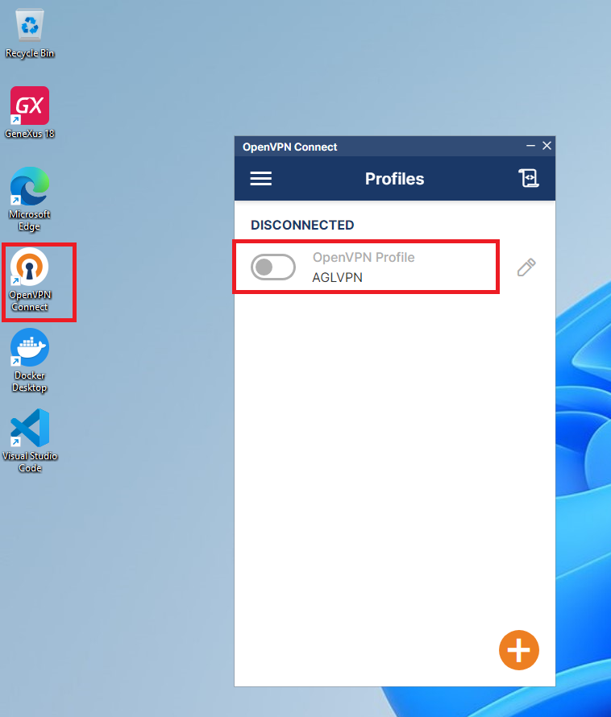

#### Passo 2

Abrir o Genexus e carregar a KB "HandsOnOtel".

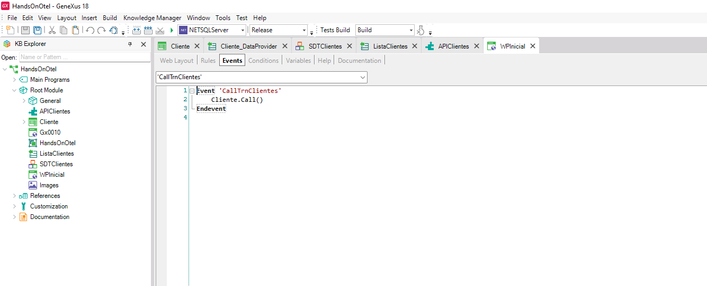

#### Passo 3 

Inicializar o Docker clicando no ícone do docker.

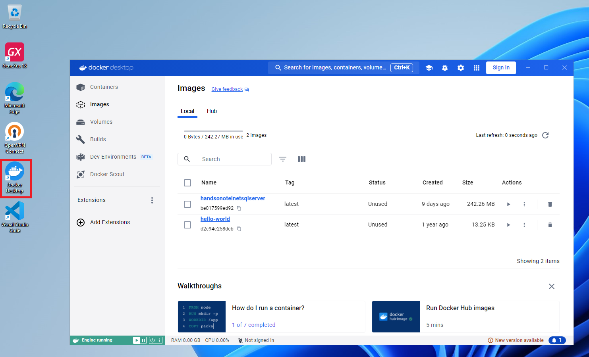

#### Passo 4

Ao executar a aplicação através do Genexus, vemos que existe uma API chamada "APIClientes", ao executar a API ListarClientes, é retornado a listagem de clientes.

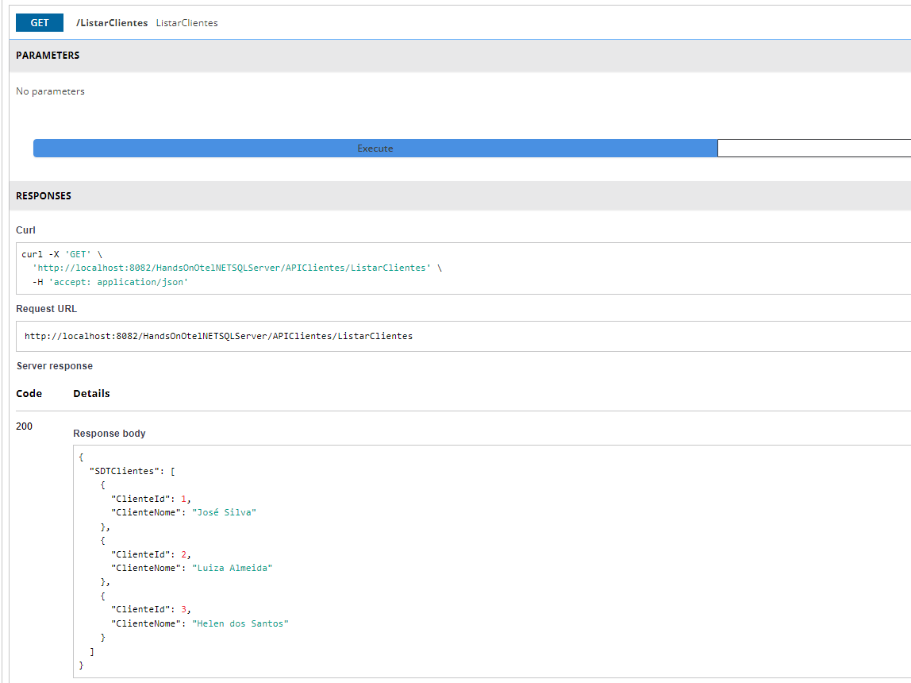

#### Passo 5

Vamos configurar a aplicação Genexus para que ela envie o log, trace e métricas para o coletor. Para isso iremos seguir os passos descritos na documentação abaixo:

- [Documentação sobre o Observabilidade com OpenTelemetry](https://wiki.genexus.com/commwiki/wiki?53775,Observability+with+OpenTelemetry)

Inicialmente vamos configurar a propriedade "Observability Provider" no backend da aplicação.

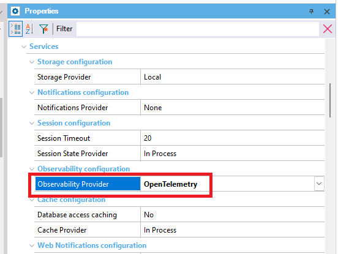

- [Documentação sobre o Observability Provider ](https://wiki.genexus.com/commwiki/wiki?53408,Observability+Provider+property)

#### Passo 6

Executar um build all para a configuração ser aplicada.

#### Passo 7

A documentação indica a execução do coletor do OpenTelemetry, ele será executado quando executarmos o docker compose.

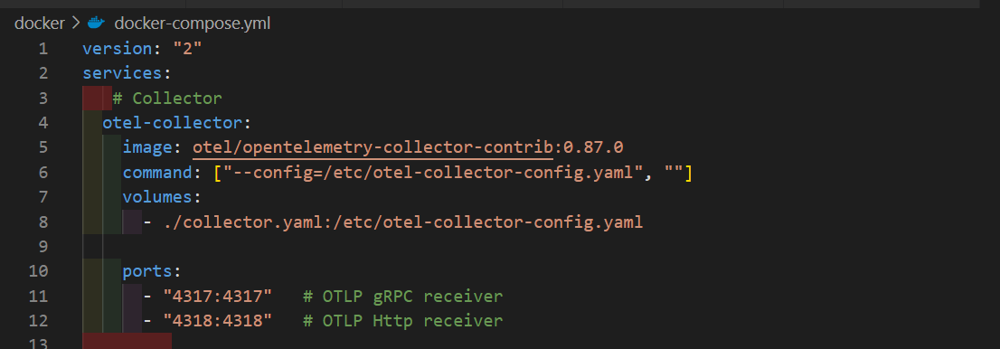

#### Passo 8

Para enviar as informações para o coletor é necessário configurar as variáveis de ambiente indicando o endereço / porta do coletor.
Essas configurações estão já no arquivo docker-compose.yml que foi copiado para a pasta C:\KBs\HandsOnOtel\NETSQLServer002.

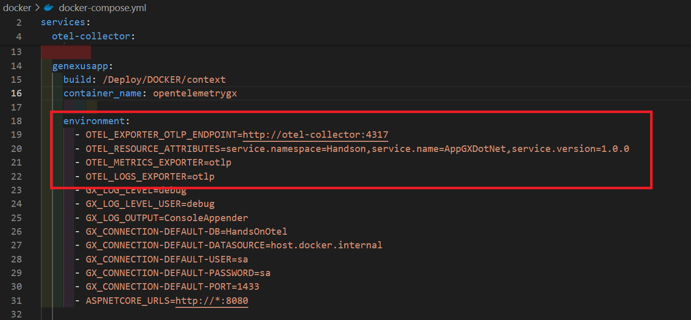

#### Passo 9

A configuração do coletor está feita no arquivo collector.yaml que já se encontra na pasta C:\KBs\HandsOnOtel\NETSQLServer002.

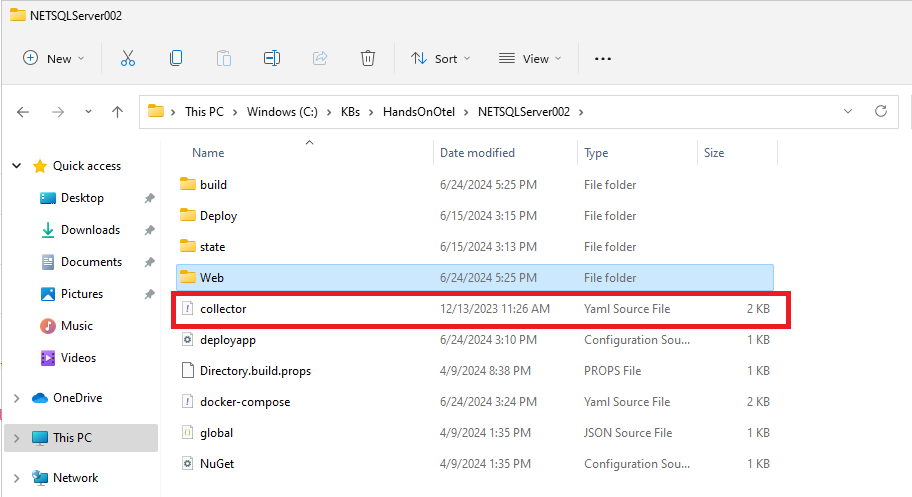

#### Passo 10

Para executar a aplicação Genexus e outros os componentes, vamos usar o docker compose, para isso use a opção "CMD Environment Directory" do menu Tools do Genexus.

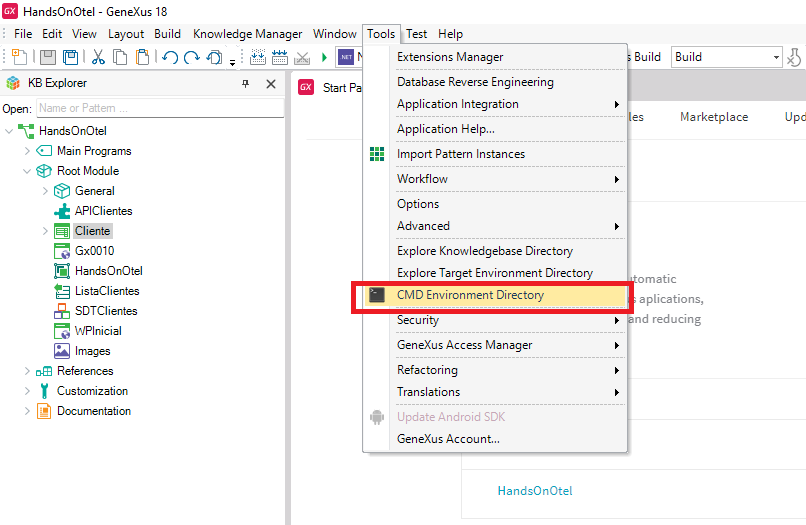

E digitar o comando "docker-compose up" na linha de comando.

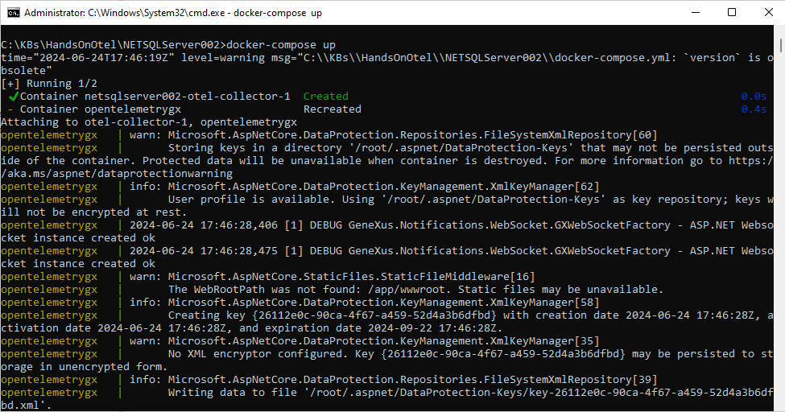

#### Passo 11

Para executar um request a api, abra o Visual Code, e abra a pasta C:\HandsonGXOTEL. Clique no arquivo requestdocker.http.

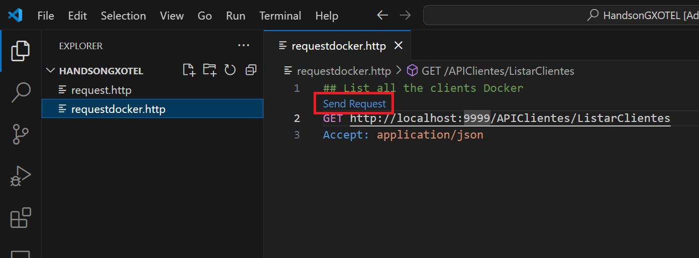

A resposta deverá ser a seguinte:

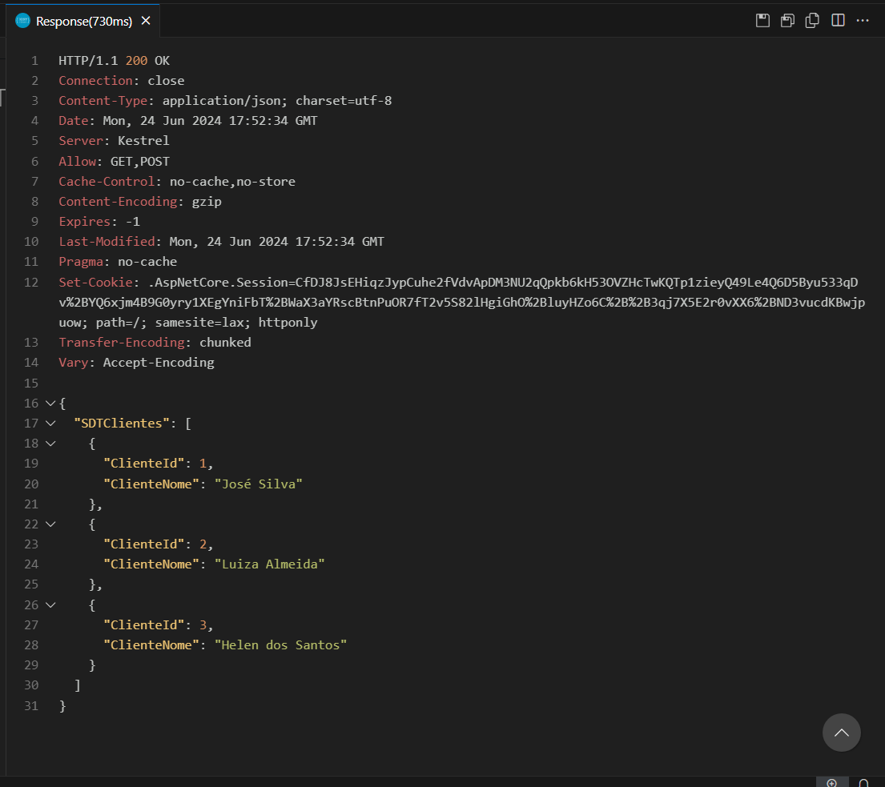

Próxima atividade: [Atividade 03](03-atividade.md)

