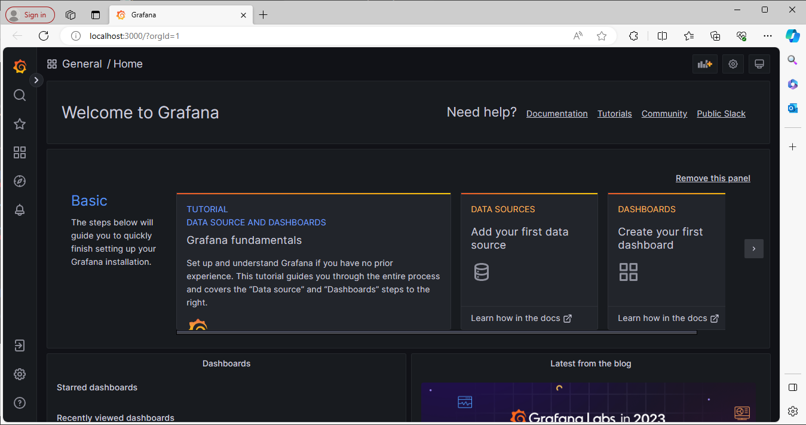

# Atividade 3

#### Passo 1

Agora iremos acessar o Grafana e pesquisar os dados gerados.

Clicar no link abaixo para acessar o Grafana:

- [Grafana local](http://localhost:3000)

Será apresentado a tela inicial do Grafana.

https://wiki.genexus.com/commwiki/wiki?55801,Generate+Observability+span+property

### Configurar  traces.

https://wiki.genexus.com/commwiki/wiki?57566,Manual+Instrumentation%3A+Tracing

Próxima atividade: [Atividade 04](04-atividade.md)

